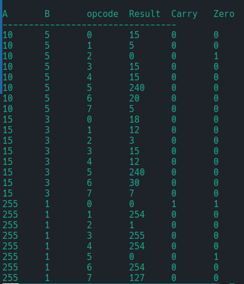

# 8-bit ALU Simulation (Verilog + Verilator + C++)

## Overview
This project implements an 8-bit Arithmetic Logic Unit (ALU) using **Verilog**, tested with a **C++ testbench** through **Verilator**.

The ALU performs a set of basic arithmetic and logic operations on two 8-bit inputs.  
The purpose of this project is to demonstrate an understanding of digital design, hardware simulation, and verification workflows.

## Features
- 8-bit arithmetic and logic operations
- Carry and Zero flag generation
- Fully combinational design (no clock required)
- Simulated using Verilator and tested with C++

## How It Works
1. The Verilog ALU takes two 8-bit inputs (`A`, `B`) and a 3-bit control signal (`opcode`).
2. The operation is selected based on the opcode.
3. The result, carry, and zero flags are generated accordingly.
4. The C++ testbench applies several test cases, evaluates the ALU outputs, and prints results in a formatted table.

### Example Output

## Tools Used
- **Verilog** for hardware design  
- **Verilator** for simulation  
- **C++** for testbench development  
- **GTKWave** *(optional)* for waveform visualisation

## Learning Outcomes
- Practised fundamental Verilog design and combinational logic.
- Learnt how to connect hardware modules to C++ testbenches using Verilator.
- Understood the hardware simulation and verification workflow.

---

> **Next steps:** Add randomised testing and waveform tracing to improve verification coverage and analysis.
